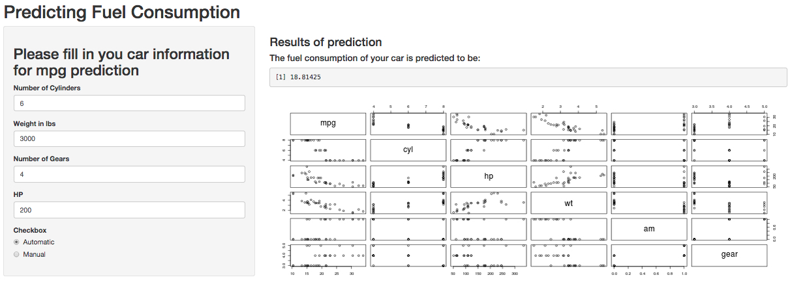

## About this Presentation
- This presentation is intended to pitch the ShinyApp for the course project.
- This presentation intends to predict your's car fuel consumption (in miles per gallon), using the 'mtcars' dataset (included in R) in a regression model using "mpg" as outcome and some of the remaining variables as predictors.


--- .class #id

## Generating a model to be used as prediction

- For this app, we chose to use a simple regression model
```{r, results='hide'}
data(mtcars)
fitLRM <- lm(mpg ~ cyl + wt + am + hp + gear, data=mtcars)
```
- We build a new dataset with the user input
```{r, results='hide',eval=FALSE}
nds <- data.frame(mpg ='0', cyl=cylinder, wt = weight/1000, 
                  am=as.numeric(transmission), hp=horsepower,gear=gears)
```
- And a simple prediction algo using the standard "predict" function
```{r, results='hide', eval=FALSE}
predict(fitLRM, newdata=nds)
```


--- .class #id 

## Predicting your car fuel consumption
- Since the idea is to predict your car consumption, we present a form where you can input the needed information about your car. This information includes:
- Number of cylinders
- Number of forward gears
- Wether the transmission is automatic or manual
- The car HP
- The car weight (in lbs)


--- .class #id 

## User input screen and prediction output
</img>

- For curiosity sake we also can see the relationship among the predictors <br>
- You can access the live app at: https://betocaeirojr.shinyapps.io/FuelPrediction/
- You can access the whole project at: https://github.com/betocaeirojr/DataProducts/tree/master/FuelConsumptionPrediction
